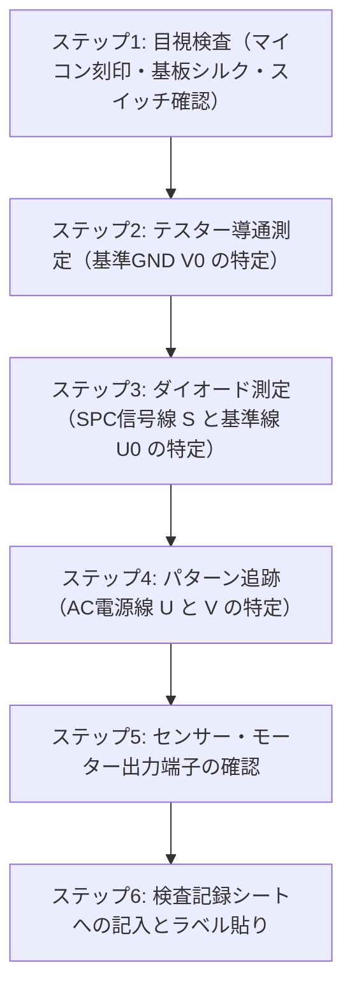

# 実物SPC3受信基板 目視＆テスター導通検査マニュアル (Board Inspection Guide)

本ドキュメントは、入手した方向幕の**「受信側基板（小糸工業製 SPC3制御基板）」**が手元に届いた際、電源を一切入れずに手持ちのテスター（デジタルマルチメーター）と目視だけで端子配置や通信仕様を特定するための検査手順書です。

---

## 1. 検査前の準備

### 必要な工具・道具
* **デジタルマルチメーター（テスター）**:
  * 導通チェックモード（ブザー音）
  * ダイオード測定モード（`─┤>├─` 記号）
  * 抵抗測定モード（Ω）
* **マスキングテープ ＆ 油性ペン**:
  * 特定した端子にピン名ラベルを貼るために使用。
* **スマートフォン等のカメラ**:
  * 基板全体の表・裏、マイコン刻印、ディップスイッチの位置を記録。

> [!CAUTION]
> **本検査は完全無通電（電源を一切繋がない状態）で実施してください。**
> 誤った端子にAC100Vを接続すると基板のマイコンが破損するため、事前の端子特定が必須です。

---

## 2. 検査手順フロー

---

## 3. 具体的な検査手順

### ステップ1: 目視検査（プロトコルと基板素性の確定）

基板を手元に置き、ルーペやスマホの拡大カメラ等で以下の3点を確認します。

1. **メインマイコンの印字**:
   * 基板上で最も大きいIC（通常28〜40ピンのDIPまたはQFPパッケージ）の表面を確認します。
   * **「SPC3」**（または `SPC-3`、`小糸工業`）の文字があるか確認します。
   * ※「SPC500」や「RS485」の表記がある場合は通信方式が異なるためメモしておきます。
2. **アドレス設定ディップスイッチ / ジャンパ**:
   * 小型ディップスイッチ（2〜4極のON/OFFスイッチ）やジャンパピンの有無を確認します。
   * 受信アドレス（0〜15）を決めるスイッチです。**届いた時点のON/OFF位置を必ず写真で記録**してください。
3. **コネクタ付近のシルク印刷**:
   * コネクタの脇に白文字で端子名が印刷されていないか確認します。
   * `U`, `V`, `U0`, `S`, `V0`、あるいは `L`, `N`, `SIG`, `COM` などの文字があればその位置を記録します。

---

### ステップ2: 基準GND（`V0`）の特定（導通ブザー測定）

SPC信号の基準電位となる `V0`（0V）を特定します。

1. テスターを **「導通ブザーモード」** に設定します。
2. 基板上の **電解コンデンサ（円筒形の部品）** を探します。
   * 電解コンデンサの側面にマイナス帯（`―` 印）が印刷されている側の足が基板のGNDです。
3. 黒プローブを電解コンデンサのマイナス端子に固定します。
4. 赤プローブで、入力コネクタのピンを1本ずつ当たっていきます。
5. **判定**:
   * **「ピー」とブザーが鳴り、抵抗値が 0Ω（直結）を示すピンが `V0`（SPC信号 GND）** です。
   * マスキングテープに「V0」と書いてその端子に貼ります。

---

### ステップ3: SPC信号線（`S`）と基準線（`U0`）の特定（ダイオード測定）

基板の入力部には、高圧からマイコンを保護する受信用フォトカプラ（4ピンまたは6ピンの黒い小型IC、PC817等）が配置されています。フォトカプラ内蔵LEDの順方向電圧（Vf）を利用して端子を特定します。

1. テスターを **「ダイオード測定モード（`─┤>├─`）」** に設定します。
2. コネクタの端子間に赤プローブ（+）と黒プローブ（-）を当てて測定します。
3. **判定**:
   * プローブを当てたとき、**約 1.1V 〜 1.4V の電圧降下** が表示される端子のペアを探します。
   * 赤と黒を逆に差し替えたときに「OL（導通なし）」または異なる数値になれば、フォトカプラのLEDを測定できています。
   * **`U0`**: 基準電圧側（+100Vパルス入力）
   * **`S`**: 信号線側（変調パルス受信用）
4. それぞれの端子に「U0」「S」の仮ラベルを貼ります。

---

### ステップ4: AC電源線（`U` / `V`）の特定

幕巻き取りモーターや蛍光灯を動かすための商用AC100V入力端子を特定します。

1. 基板裏面の銅箔パターンを観察します。
   * `U0` や `S` の信号線パターンは細い（幅1mm未満）のに対し、**モーター駆動用の `U` と `V` のパターンは電流容量を確保するため太く（幅3mm以上）作られています**。
2. **ニュートラル `V` と `V0` の関係確認**:
   * テスターを導通ブザーモードにし、ステップ2で特定した `V0` と、太いパターンの端子を測定します。
   * 多くの場合、**AC電源のニュートラル端子 `V` は `V0` と基板上で直結（0Ω導通）** しています。
   * 直結している太い端子が **`V`（AC100Vニュートラル）** です。
3. 残るもう1本の太い端子（基板上のリレー接点やヒューズに繋がっているライン）が **`U`（AC100Vホット）** です。

---

### ステップ5: センサー端子・モーター出力端子の確認

入力コネクタ以外に端子がある場合、以下の用途に分かれています。

1. **バーコード読み取りセンサー端子**:
   * 幕の端にある黒いバーコードを読み取る光学センサー（3〜4線: DC5V, GND, 信号A, 信号B）への接続コネクタです。
2. **モーター出力端子**:
   * 基板上のリレー（正転用・逆転用）からモーターに伸びる配線です。

---

## 4. 検査記録シート（記入用ワークシート）

基板を測定しながら、以下の表に結果を記入してください。

| ピン番号 | コネクタ位置・線色 | テスター測定結果（導通 / Vf値 / パターン幅） | 推定される信号名 | 確定 |
| :---: | :--- | :--- | :---: | :---: |
| **1** | 例: 端子台左端 / 赤線 | 幅広パターン、リレー接点に接続 | **`U`** (AC100V Hot) | [ ] |
| **2** | 例: 端子台2番目 / 白線 | 幅広パターン、V0と0Ω短絡 | **`V`** (AC100V Neutral) | [ ] |
| **3** | 例: 端子台3番目 / 黄線 | ダイオードモードで約1.2V | **`U0`** (SPC基準線) | [ ] |
| **4** | 例: 端子台4番目 / 青線 | ダイオードモードで極性あり導通 | **`S`** (SPC信号線) | [ ] |
| **5** | 例: 端子台5番目 / 黒線 | 電解コンデンサ(-)と0Ω直結 | **`V0`** (SPC GND) | [ ] |
| **6** | 例: 端子台右端 / 緑線 | 基板ネジ穴・金属部に直結 | **`FG`** (アース) | [ ] |

---

## 5. 次のステップ（基板確認後の作業）

1. **端子特定完了**:
   * すべての端子にラベルを貼り、記録シートが埋まったら基板側の準備は完了です。
2. **部品調達**:
   * 自作指令器回路の主要部品（単巻変圧器 NSR-05LN、トライアック BTA16、フォトトライアック MOC3041、フォトカプラ PC817等）の手配を進めます。
3. **幕本体の到着待ち**:
   * 幕本体（巻取機一式）が届いた際、この基板のコネクタと幕本体の配線を接続します。
