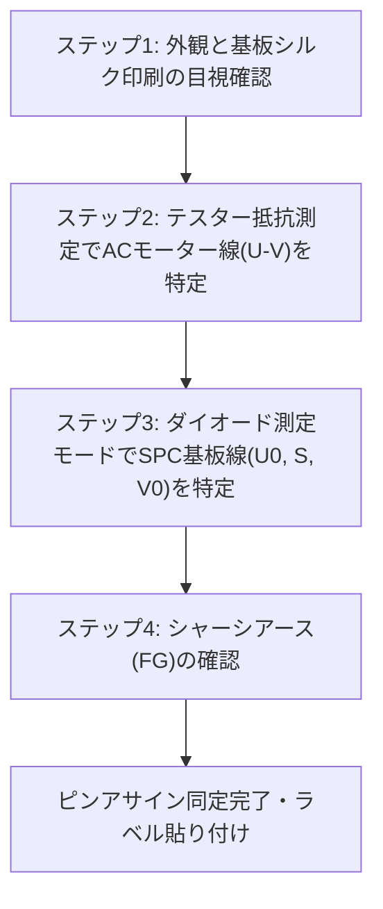
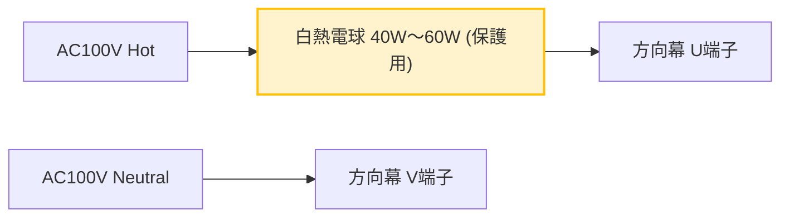

# 実物方向幕の配線・ピン特定マニュアル (How-To Guide)

## 1. はじめに
鉄道廃品・部品即売会等で入手した方向幕（巻取機）は、車両から切り離されたケーブルや多極コネクタの状態で手元にあることが一般的です。
本マニュアルは、デジタルテスターを用いて手元の方向幕の配線を安全に調査し、自作SPC指令器と接続すべき **5つの必須ライン（`U`, `V`, `U0`, `S`, `V0`）** を確実に特定するための実践的ガイドです。

---

## 2. 接続すべき5つの必須ライン

実車配線（引通線）において、方向幕に接続されている信号線は以下の通りです。

| 信号記号 | 名称 | 役割 | 電圧・電気的特性 |
| :--- | :--- | :--- | :--- |
| **`U`** | AC100V ホット (L) | 幕巻き取りACモーター・蛍光灯駆動電源 | 商用 AC100V（非接地側） |
| **`V`** | AC100V ニュートラル (N) | AC電源 接地側ライン | AC100V（接地側 0V基準） |
| **`U0`** | SPC基準線 | 方向幕制御基板（SPC3）の同期基準電源 | +100V 全波整流パルス |
| **`S`** | SPC信号線 | 指令データ受信 ＆ アンサーバック送信 | スイッチング正負半波パルス |
| **`V0`** | SPC信号 GND | SPC信号系の基準0V | **`V`（ACニュートラル）と共通** |
| *(E)* | *アース (FG)* | *フレームグランド（筐体金属部接地）* | *安全用接地* |

---

## 3. テスターを使ったピン特定手順（4ステップ）

デジタルマルチメーター（テスター）を1台用意してください。**（※この段階ではACコンセントには絶対に接続しないでください）**



### ステップ1: 外観と基板シルク印刷の目視確認
1. **制御基板の位置を確認**:
   * 方向幕のフレーム裏面や側面に、緑色の電子基板（SPC3基板）が取り付けられています。
2. **基板上のシルク印刷を探す**:
   * 基板のコネクタ付近や端子台に、白文字で **`U` `V` `U0` `S` `V0`**、または **`U0` `S` `G`** などの刻印があるか確認します。
   * 端子に配線されている電線の色をメモします（例: 赤=U, 白=V, 黄=U0, 青=S, 黒=V0 等）。
3. **マイコン型番の確認**:
   * メインマイコン上に「**SPC3**」の表記があれば、本設計のAC100V 60Hz同期方式で間違いありません。

---

### ステップ2: モーター駆動ライン（`U` / `V`）の特定
方向幕には幕を回すための単相AC100Vモーター（またはDCモーター用電源ユニット）と、幕を照らす蛍光灯/LED照明が内蔵されています。

1. **テスターを「抵抗測定モード（Ω）」に設定**。
2. コネクタの端子間を順に総当たりで測定します。
3. **判定基準**:
   * **数十Ω〜数百Ω（約30Ω〜150Ω程度）の抵抗値** が出るペアが見つかります。これが **モーター巻線（`U` と `V`）** です。
   * 幕を手で少し回すと、モーターの発電作用により抵抗値がわずかに変動します。
   * 蛍光灯インバータが並列に入っている場合もありますが、直流抵抗としてはモーター巻線が支配的になります。

---

### ステップ3: SPC信号ライン（`U0` / `S` / `V0`）の特定
SPC制御基板の入力部には、商用AC100Vからマイコンを保護するための**「受信用フォトカプラ」**が配置されています。フォトカプラのLED特性を利用して特定します。

1. **テスターを「ダイオード測定モード（`─┤>├─`）」に設定**。
   * （ダイオード測定モードは、端子間に微小電圧を出力して順方向電圧降下 Vf を測定するモードです。）
2. ステップ2で見つかった `U` `V` 以外の端子ペアを測定します。
3. **判定基準**:
   * **約 1.0V 〜 1.4V（フォトカプラ内蔵赤外線LEDの Vf ＋ 逆並列ダイオード降下）** の電圧降下が表示される端子があります。
   * プローブの赤（プラス）と黒（マイナス）を入れ替えると導通状態が変わる端子が **信号線 `S` および 基準線 `U0`** です。
   * 基板の GND パターン（電解コンデンサのマイナス側やベタGND）と直結している端子が **`V0`（SPC信号 GND）** です。
   * ※多くの個体では、`V0` は ACニュートラルの `V` 端子と内部で短絡（0Ω導通）しています。

---

### ステップ4: アース（FG / E）の確認
1. **テスターを「導通ブザーモード」に設定**。
2. 片方のプローブを方向幕の**金属フレーム（無塗装のネジ部等）**に当てます。
3. コネクタの各端子に当てて、ブザーが鳴る端子（0Ω）を探します。
4. ブザーが鳴った端子が **フレームグランド（アース `E`）** です。
   * （※アース線には絶対にAC100Vホットを接続しないでください。）

---

## 4. 代表的なコネクタ形状とピンアサイン例

名鉄や大手私鉄の小糸製方向幕でよく使用されているコネクタの標準的配置例です。

### 例1: サンワコネクター / 丸型メタルコネクタ（7ピン〜8ピン）

```text
       ┌──────────────┐
    ／        ▲         ＼     (キー突起を上にした正面図)
  ／   (A)   [キー]  (B)   ＼
 │                          │
 │  (G)       (H)       (C) │
 │                          │
  ＼   (F)          (D)    ／
    ＼        (E)        ／
       └──────────────┘
```

| ピン記号 | 信号名 | 標準的な配線色 | 備考 |
| :---: | :--- | :--- | :--- |
| **A** | **`U`** | 赤 / 黒 | AC100V L (モーター・照明電源) |
| **B** | **`V`** | 白 | AC100V N (共通ニュートラル) |
| **C** | **`U0`**| 黄 / 橙 | SPC基準電源線 (+100V全波) |
| **D** | **`S`** | 青 / 空色 | SPC双方向信号線 (指令・AB) |
| **E** | **`V0`**| 白 / 黒 | SPC信号GND (B端子と内部導通) |
| **F** | *(NC)* | ─ | 未使用または連動検知線 |
| **G** | **`E`** | 緑 / 緑黄 | フレームアース (外枠金属部) |

*(※車両形式や製造年・更新時期によってピン配置が異なる場合があります。必ずテスターで測定して最終確認を行ってください。)*

---

## 5. 初回通電時の安全テスト手順（電球直列法）

配線が同定できたら、いきなりACコンセント直結で通電するのではなく、**白熱電球（40W〜60W / 100V）を安全リミッターとして直列に挟むテスト**を強く推奨します。



* **安全確認の原理**:
  * **配線が正しい場合**: 幕の蛍光灯が点灯、またはモーター待機電流のみが流れ、電球は**「ぼんやり光る程度（または消灯）」**となります。
  * **万一ショートしている場合**: 電球が**「全力で眩しく点灯」**し、電球自体が負荷となるため、ブレーカーが落ちたり基板が破損するのを100%防ぐことができます。

---
*特定が完了したら、各線にマスキングテープ等で「U」「V」「U0」「S」「V0」のラベルを貼り付けておくと、指令器との接続がスムーズになります。*
