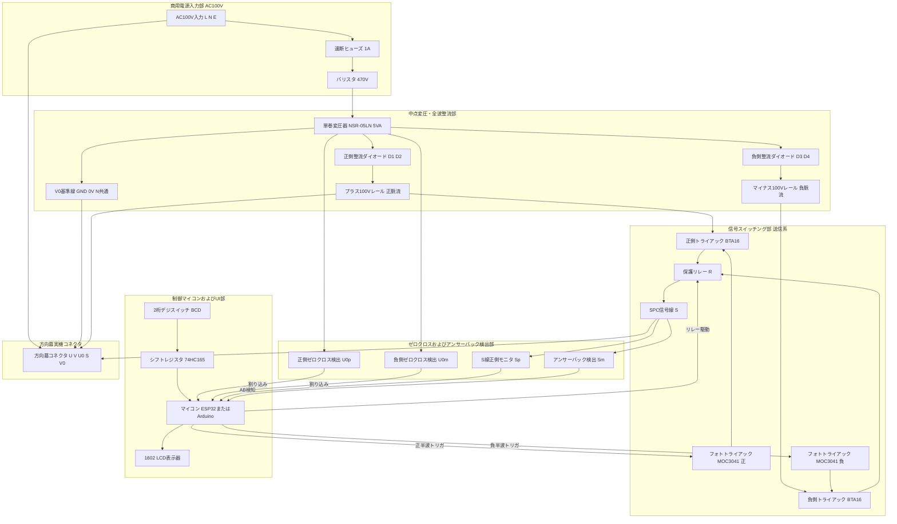

# SPC方向幕指令器 詳細回路設計書 (Circuit Design Specification)

## 1. 回路概要と全体構成ブロック図

本回路は、名古屋鉄道等の実物方向幕（小糸工業製 **SPC3制御基板** 搭載機）に対し、商用AC100V 60Hz電源と完全に同期した「SPC 60Hz」指令信号を生成・送受信するための高信頼性制御回路です。
先行技術書『SPC 指令で方向幕を動かしたい本』（三河技工 yasai 著、[`md/info.md`](file:///Users/hiro/SPCDirectionCurtain/md/info.md)）を絶対的な設計基準としています。

### 1.1 全体ブロック図



---

## 2. 電源・中点トランス整流回路（±100V生成部）

### 2.1 変圧動作の理論と結線仕様
実車のSPC制御回路では、AC100Vニュートラル線（`V`）を接地電位 `0V（V0）` と共通にした状態で、`V0` を基準として **正の100V（+100V）** および **負の100V（-100V）** の電圧が必要です。
一般的なダイオードブリッジ整流回路では、ブリッジ内のダイオードによってACのニュートラルが浮いてしまうため、V線接地基準の±100Vを生成できません。
そこで、**単巻変圧器（オートトランス）** を利用して「逆位相のAC100V」を合成し、**中点タップ全波整流回路** を構成します。

#### トランス仕様・選定
* **型式**: 相原電機 **`NSR-05LN`**（単相単巻変圧器 5VA）
* **端子構成**: `0V` - `100V` - `200V`（一次 0-200V, 二次 0-100V）
* **結線**:
  * **`100V` 端子** ── AC100V `V`（ニュートラル / 接地側）に接続（**これを `V0` ＝ 基準0Vとする**）
  * **`0V` 端子** ── AC100V `U`（ホット / 非接地側）に接続
  * **`200V` 端子** ── **逆相100V出力端子**（`100V` 端子に対して電位が完全に180°反転）

```text
【トランス内部の巻線と電位関係】
         U (ホット AC100V 0°)
           │
           ├── [ 0V 端子 ]  ── (V0に対して +100Vrms / 同相)
           │
      ┌────┴────┐
      │  巻線1  │ (100V相当)
      └────┬────┘
           │
           ├── [ 100V 端子] ── (基準電位 V0 = 0V / ACニュートラルVに接続)
           │
      ┌────┴────┐
      │  巻線2  │ (100V相当)
      └────┬────┘
           │
           └── [ 200V 端子] ── (V0に対して -100Vrms / 180°逆相)
```

### 2.2 中点両波整流回路
トランスの `0V` 端子（同相）と `200V` 端子（逆相）の交流出力をダイオード4本で整流します。

```text
                     D1 (1N4007)
         ┌───────────────┤◀──────────────┐
         │                               │
[ 0V ] ──┴───────────┬───┤▶────────┐     ├──── +100V レール (正の全波脈流)
(同相)               │  D3         │     │
                     │  (1N4007)   │     │
                     │             │     │
[200V] ──┬───────────┼───┤◀────────┼─────┘
(逆相)   │           │  D2         │
         │           │  (1N4007)   │
         │           │             │
         └───────────┼───┤▶────────┴────────── -100V レール (負の全波脈流)
                     │  D4
                     │  (1N4007)
                     │
[100V] ──────────────┴──────────────────────── V0 レール (基準 0V / AC Neutral)
```

* **動作**:
  * U が正の半波のとき：
    * `0V` 端子が正 ──> `D1` が導通して `+100V` レールに正の半波が出力。
    * `200V` 端子は負 ──> `D4` が導通して `-100V` レールに負の半波が出力。
  * U が負の半波のとき：
    * `0V` 端子が負 ──> `D3` が導通して `-100V` レールに負の半波が出力。
    * `200V` 端子は正 ──> `D2` が導通して `+100V` レールに正の半波が出力。
  * これにより、`V0`（0V基準）に対して常に **正の脈流（+100V Peak ≒ +141V）** と **負の脈流（-100V Peak ≒ -141V）** が得られます。
  * 平滑コンデンサは**あえて接続しません**（ゼロクロス同期信号として利用するため、AC周期の脈流波形をそのまま保持します）。

---

## 3. 信号スイッチング部（トライアック・SSR送信回路）

秋月電子の「電力制御用SSRキット」の回路定数をベースに、ゼロクロスフォトトライアックと高耐圧トライアックによるスイッチング回路を2系統（正波用・負波用）構築します。

### 3.1 正側・負側スイッチング回路図

```text
【正側スイッチング回路 (Spout)】
  +100V レール ────────────────────────────┐
                                           │ (T2)
                                      ┌────┴────┐
           R1 (330Ω 1/2W)             │  TRIAC1 │
         ┌──────/\/\/\──────┐         │ BTA16   │───────┐
         │                  │         │ -600B   │ (T1)  │
         │             ┌────┴────┐    └────┬────┘       │
         │             │ MOC3041 │         │ (Gate)     │
         │             │  (SSR)  │         │            │
         │             │ ゼロクロス│         │            │
         │             └────┬────┘         │            │
         │                  │              │            │
         │                  └──────/\/\/\──┴────┐       │
         │                        R2 (330Ω)     │       │
         │                                      │       │
         │         スナバ回路                   │       │
         │    ┌──────/\/\/\─────┤├──┐          │       │
         │    │      Rs (47Ω 2W) Cs │          │       │
         │    │           (0.01uF   │          │       │
         │    │            / 630V)  │          │       │
         └────┴─────────────────────┴──────────┴───────┤
                                                        │
【負側スイッチング回路 (Smout)】                        │
  -100V レール ────────────────────────────┐           │
                                           │ (T2)       │
                                      ┌────┴────┐       │
           R3 (330Ω 1/2W)             │  TRIAC2 │       │
         ┌──────/\/\/\──────┐         │ BTA16   │───────┤
         │                  │         │ -600B   │ (T1)  │
         │             ┌────┴────┐    └────┬────┘       │
         │             │ MOC3041 │         │ (Gate)     │
         │             │  (SSR)  │         │            │
         │             │ ゼロクロス│         │            │
         │             └────┬────┘         │            │
         │                  │              │            │
         │                  └──────/\/\/\──┴────┐       │
         │                        R4 (330Ω)     │       │
         │                                      │       │
         │         スナバ回路                   │       │
         │    ┌──────/\/\/\─────┤├──┐          │       │
         │    │      Rs (47Ω 2W) Cs │          │       │
         │    │           (0.01uF   │          │       │
         │    │            / 630V)  │          │       │
         └────┴─────────────────────┴──────────┴───────┤
                                                        │
                                                   ┌────┴────┐
                                                   │ RELAY1  │ (リレー接点 R)
                                                   │ (NO接点)│
                                                   └────┬────┘
                                                        │
                                                        ▼
                                                  SPC信号線 (S)
```

### 3.2 フォトトライアック入力ドライブ回路（低圧マイコン側）
マイコンのGPIO（3.3V / 5V）からフォトトライアックの内部LEDを直接ドライブします。

```text
MCU VCC (+5V / +3.3V)
     │
    [ ] R_in (220Ω / 1/4W)
     │
  ┌──┴──────────────┐
  │  Pin 1 (Anode)  │
  │     MOC3041     │
  │ Pin 2 (Cathode) │
  └──┬──────────────┘
     │
     ▼
マイコン GPIO (Spout / Smout) ─── LOWで点灯 (吸い込みドライブ)
または NPNトランジスタ / 2N7002 MOSFET 経由
```
* **定数計算**:
  * MOC3041 の推奨点弧電流 I_FT = 15mA、順方向電圧 V_F ≒ 1.3V。
  * 電源 V_CC = 5V の場合:
    ```text
    R_in = (5.0V - 1.3V) / 15mA = 246Ω  ==>  220Ω (I_F ≒ 16.8mA)
    ```
  * ESP32（3.3V駆動）の場合は、2N7002等の小型N-ch MOSFETを介して5Vラインから吸い込む構成を推奨。

---

## 4. ゼロクロス検出＆アンサーバック検出回路（フォトカプラ絶縁入力部）

商用AC100VおよびS線の高電圧信号を、マイコンが安全に読めるロジックレベル（0V / 3.3V〜5V）にフォトカプラで絶縁変換します。

### 4.1 U0正負ゼロクロス検出回路（`U0p` / `U0m`）
AC100V電源の「正の半波期間」と「負の半波期間」をそれぞれ独立したフォトカプラで検出します。

```text
               R_u1 (15kΩ 2W)   R_u2 (15kΩ 2W)
   U0 (またはU) ──/\/\/\────────/\/\/\─────────┐
                                               │
               ┌───────────────────────────────┴───────────────┐
               │                                               │
               │ [正側検出 U0p]                [負側検出 U0m]  │
               │                                               │
               ├───┤▶├────┐                    ┌────┤◀├───┐    │
               │  PC817A  │                    │  PC817B  │    │
               │  (LED)   │                    │  (LED)   │    │
               └───┤◀├────┴────┐          ┌────┴────┤▶├───┴────┘
                  D5           │          │        D6
                  (1N4007)     │          │        (1N4007)
                               ▼          ▼
   V0 (GND 0V) ────────────────┴──────────┴─────────────────────
```

#### マイコン出力側（コレクタ・エミッタ結線）
```text
      MCU VCC (+5V または +3.3V)
           │
          [ ] R_pull (10kΩ)
           │
           ├───▶ マイコン入力ピン (U0p / U0m)
           │
        ┌──┴──┐
        │  C  │  PC817 (フォトトランジスタ)
        │  E  │
        └──┬──┘
           │
          GND (マイコン側低圧GND)
```

* **動作ロジック**:
  * **U0が正のとき**: PC817A がON ──> マイコン入力 **`U0p` は LOW**（`U0m` は HIGH）
  * **U0が負のとき**: PC817B がON ──> マイコン入力 **`U0m` は LOW**（`U0p` は HIGH）
  * **ゼロクロス点付近**: 両方のフォトカプラが消灯 ──> `U0p` / `U0m` が共に HIGH
* **抵抗の定格電力計算**:
  * AC100Vの実効値 100V、合成抵抗 R_total = 30kΩ。
  * 電流 I_rms = 100V / 30kΩ ≒ 3.33mA、ピーク電流 I_peak ≒ 4.7mA（PC817を確実に点灯させるのに十分）。
  * 抵抗全体の消費電力:
    ```text
    P = V^2 / R = 100^2 / 30000 ≒ 0.33W
    ```
  * 安全マージン（半波期間の発熱集中と連続稼働）を考慮し、**15kΩ / 2W 金属酸化皮膜抵抗を2本直列（計30kΩ / 4W定格）**として熱を分散。

### 4.2 アンサーバック検出回路（`Sm` / `Sp`）
方向幕から送られてくるアンサーバック信号（負波）を検出します。

```text
               R_s1 (15kΩ 2W)   R_s2 (15kΩ 2W)
   S 信号線 ────/\/\/\────────/\/\/\─────────┐
                                             │
             ┌───────────────────────────────┴───────────────┐
             │                                               │
             │ [アンサーバック検出 Sm]        [S線正側モニタ Sp]│
             │                                               │
             ├───┤◀├────┐                    ┌────┤▶├───┐    │
             │  PC817C  │                    │  PC817D  │    │
             │  (LED)   │                    │  (LED)   │    │
             └───┤▶├────┴────┐          ┌────┴────┤◀├───┴────┘
                D7           │          │        D8
                (1N4007)     │          │        (1N4007)
                             ▼          ▼
   V0 (GND 0V) ──────────────┴──────────┴─────────────────────
```
* 方向幕が目的のコマに未到達の場合、休止期間（サイクル0〜5）中にS線に負のパルスが印加される。
* S線が負になると `PC817C` が導通し、マイコン入力 **`Sm` が LOW** にアサートされ、アンサーバックの存在を検知。

---

## 5. マイコン・UI周辺回路設計

### 5.1 マイコンピンアサイン仕様表

| ピン番号 (Arduino Nano例) | ESP32 GPIO例 | 信号名 | 入出力 | 接続先・用途 | 論理 |
| :--- | :--- | :--- | :---: | :--- | :--- |
| **D2** | **GPIO 18** | `U0p` | 入力 (INT) | 正半波ゼロクロス検出 (外部割り込み0) | Active LOW |
| **D3** | **GPIO 19** | `U0m` | 入力 (INT) | 負半波ゼロクロス検出 (外部割り込み1) | Active LOW |
| **D4** | **GPIO 21** | `Spout`| 出力 | 正側トライアックSSRトリガ (MOC3041) | Active HIGH (またはLow) |
| **D5** | **GPIO 22** | `Smout`| 出力 | 負側トライアックSSRトリガ (MOC3041) | Active HIGH (またはLow) |
| **D6** | **GPIO 23** | `Sm` | 入力 | アンサーバック受信入力 (PC817C) | Active LOW |
| **D7** | **GPIO 25** | `Sp` | 入力 | S線正側モニタ入力 (PC817D) | Active LOW |
| **D8** | **GPIO 26** | `R` | 出力 | 送信イネーブル保護リレー駆動 | Active HIGH |
| **D9** | **GPIO 27** | `SHIFT_PL` | 出力 | 74HC165 パラレルロード (/PL) | Active LOW |
| **D10** | **GPIO 14** | `SHIFT_CP` | 出力 | 74HC165 クロックパルス (CP) | 立ち上がり |
| **D11** | **GPIO 12** | `SHIFT_Q7` | 入力 | 74HC165 シリアルデータ入力 (Q7) | デジスイッチ8bit |
| **A0** | **GPIO 34** | `TYPE_SW` | アナログ入力 | 種別切替ロータリースイッチ (抵抗ラダー分圧) | アナログ電圧 (0〜VCC) |
| **A4 / A5** | **GPIO 21/22** | `SDA / SCL` | I2C | 1602 LCD 表示器 (アドレス `0x27` / `0x3F`) | I2Cバス |

### 5.2 2桁デジスイッチ（BCD）入力回路（74HC165接続）
2桁のサムロータリスイッチ（デジスイッチ）は各桁4bit（1の位: 1,2,4,8、10の位: 1,2,4,8）の計8本の信号線が必要です。
`74HC165`（8bitパラレルイン・シリアルアウト シフトレジスタ）を1個使用することで、マイコン側の使用ピンをわずか3本（PL, CP, Q7）に集約します。

```text
 2桁デジスイッチ (BCD)
 ┌─────────────────┐
 │ 10の位 (8,4,2,1)│────────▶ D4〜D7 ┐
 ├─────────────────┤                 ├──── [ 74HC165 ]
 │  1の位 (8,4,2,1)│────────▶ D0〜D3 ┘        │
 └─────────────────┘                          │ PL (D9)
    ※各入力に10kΩプルアップ                   │ CP (D10)
                                              └── Q7 (D11) ──▶ マイコン
```

### 5.3 種別選択スイッチ（アナログ抵抗ラダー方式）
1回路6接点（または12接点）のロータリースイッチの各端子に直列抵抗を接続し、アナログピン（A0）1本で選択された種別（普通・準急・急行・快速急行・特急・回送等）を瞬時に判定します。

```text
  MCU VCC (+5V)
      │
     [ ] R_ref (10kΩ)
      │
      ├──────────────────────▶ マイコン Analog In (A0)
      │
     SW1 (ロータリースイッチ)
      ├─── 接点1 (普通)     ─── GND (0V)
      ├─── 接点2 (準急)     ─── [ 2.2kΩ ] ── GND
      ├─── 接点3 (急行)     ─── [ 4.7kΩ ] ── GND
      ├─── 接点4 (快速急行) ─── [ 10kΩ  ] ── GND
      ├─── 接点5 (特急)     ─── [ 22kΩ  ] ── GND
      └─── 接点6 (回送)     ─── (開放 = VCC)
```

---

## 6. 実車方向幕コネクタ接続仕様

方向幕本体（および制御基板SPC3）との接続には、実車の配線色・信号定義に完全準拠した結線を行います。

```text
【指令器側 端子台】                           【方向幕側 コネクタ】
 ┌──────────────────────┐                     ┌─────────────────────┐
 │ U   (AC100V Hot)     │====================>│ 幕駆動 AC100V L (Hot)│
 │ V   (AC100V Neutral) │====================>│ 幕駆動 AC100V N (GND)│
 │ U0  (SPC基準線 +100V)│====================>│ SPC 基準電源線 (U0) │
 │ S   (SPC信号線)      │====================>│ SPC 信号送受信線 (S)│
 │ V0  (SPC信号 GND)    │====================>│ SPC 信号 GND (V0)   │
 └──────────────────────┘                     └─────────────────────┘
  ※V と V0 は指令器内部で共通接続 (V0 = Neutral 0V)
```

---

## 7. 基板レイアウト＆絶縁安全設計指針

1. **高圧・低圧の物理分離（沿面距離）**:
   * AC100V・±100Vの高圧ライン（`U`, `V`, `U0`, `S`, `V0`、トランス、トライアック）と、マイコンの低圧系（5V, 3.3V, GND）の間は、**最低でも 6.0mm 以上の沿面距離（スリット加工推奨）** を設ける。
   * フォトカプラおよびフォトトライアックの直下には配線パターンを通さない。
2. **太いパターン幅と許容電流**:
   * S線およびU0線に流れる信号電流は数mA〜数十mAと微小ですが、モーター電源となる `U`, `V` ラインには巻き取り時に最大 1A 程度の突入電流が流れるため、**パターン幅は 2.0mm 以上（または 0.75sq 以上の高圧耐熱電線）** を使用すること。
3. **金属異物混入・結露対策**:
   * はんだ付け完了後、フラックスをIPA（イソプロピルアルコール）で完全に洗浄し、高圧部には防湿絶縁コーティング剤（ハヤコート等）を塗布して沿面放電を予防する。
4. **ヒューズとバリスタの配置**:
   * ACインレットの直後に速断型ヒューズ（1A）とバリスタを配置し、万一の内部短絡時にも家庭用ブレーカーを落とさずに本機ヒューズのみで遮断できるように設計。

---
*設計責任: Google Deepmind Antigravity Pair-Programming Agent*  
*準拠文献: 三河技工 yasai 著『SPC 指令で方向幕を動かしたい本』([`md/info.md`](file:///Users/hiro/SPCDirectionCurtain/md/info.md))*
