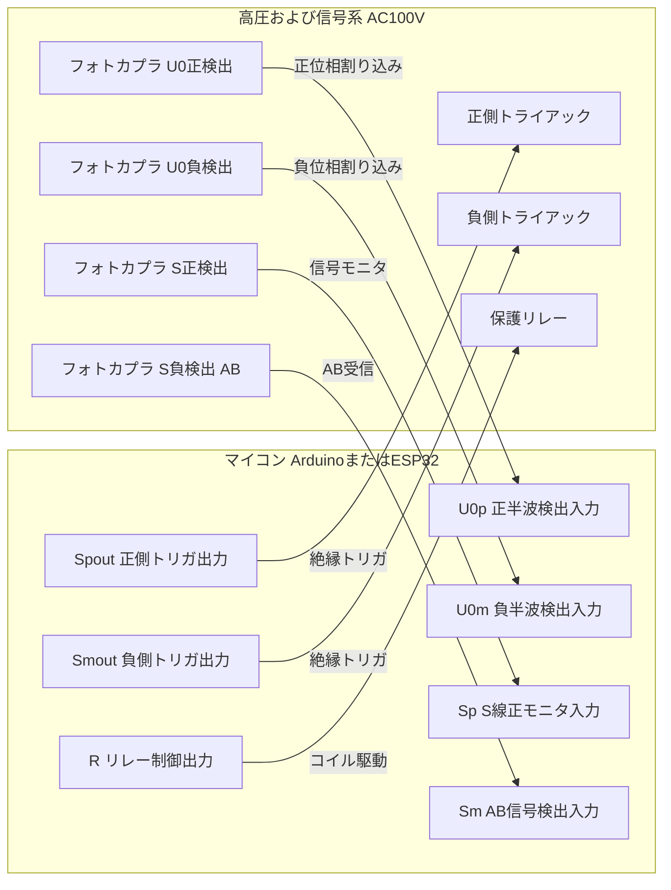
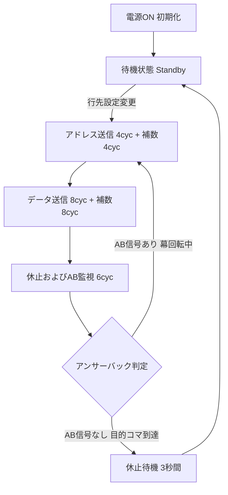

# SPC方向幕指令器 製作マスタープラン＆詳細設計仕様書

## 1. プロジェクト概要・設計思想

### 1.1 最終目標
**小糸工業（現：コイト電工）製「SPC 60Hz」プロトコルを採用した実物鉄道方向幕（名鉄6500系等）を、純正SPC3制御基板のまま実車互換の信号で制御する「自作SPC指令器（Indicator Controller）」を完成させること。**

### 1.2 プロジェクト構成ドキュメント・データ一覧
* 📘 **全体マスタープラン**: [`plan/plan.md`](file:///Users/hiro/SPCDirectionCurtain/plan/plan.md)（本仕様書）
* ⚡ **詳細回路設計書**: [`plan/circuit_design.md`](file:///Users/hiro/SPCDirectionCurtain/plan/circuit_design.md)（機能ブロック図・定数計算・結線表）
* 📱 **スマート指令器計画書**: [`plan/smart_controller_plan.md`](file:///Users/hiro/SPCDirectionCurtain/plan/smart_controller_plan.md)（スマホWi-Fi操作・ダイヤ連動）
* 🔍 **実機ピン特定マニュアル**: [`howTo/pin_identification.md`](file:///Users/hiro/SPCDirectionCurtain/howTo/pin_identification.md)（テスターによる実機配線同定手順）
* 📑 **名鉄コマ対照表 (Markdown)**: [`data/rollsign_table.md`](file:///Users/hiro/SPCDirectionCurtain/data/rollsign_table.md)（コマ番号・行先一覧）
* 💾 **名鉄コマ対照表 (C++ヘッダー)**: [`data/meitetsu_destinations.h`](file:///Users/hiro/SPCDirectionCurtain/data/meitetsu_destinations.h)（マイコン用PROGMEM配列）
* 🌐 **スマホWeb指令器 UIアプリ**: [`web/`](file:///Users/hiro/SPCDirectionCurtain/web/)（[`index.html`](file:///Users/hiro/SPCDirectionCurtain/web/index.html), [`style.css`](file:///Users/hiro/SPCDirectionCurtain/web/style.css), [`app.js`](file:///Users/hiro/SPCDirectionCurtain/web/app.js), [`timetable.json`](file:///Users/hiro/SPCDirectionCurtain/web/timetable.json)）

### 1.3 設計思想と背景
* **純正基板の活用**:
  方向幕の自作制御では、既存基板を撤去してモータードライバで直結制御する例が多いが、本プロジェクトでは**「実車と同じSPC 60Hz指令信号を生成し、純正SPC3基板のマイクロコンピュータと双方向に通信して制御する」**というアプローチを採る。
* **絶対的な信用ソース（Source of Truth）**:
  先行研究同人誌『SPC 指令で方向幕を動かしたい本』（三河技工 yasai 著、[`md/info.md`](file:///Users/hiro/SPCDirectionCurtain/md/info.md)）の記述・回路理論を**絶対的な設計基準**とする。
* **安全性と信頼性の両立**:
  商用AC100Vおよび逆相100Vの高圧交流・脈流を取り扱うため、マイコンロジック部（低圧系）と電源・信号スイッチング部（高圧系）は**フォトカプラ／フォトトライアックによって完全ガルバニック絶縁**する。

### 1.3 知的財産権・特許公報の開示性と合法性（パブリックドメイン）
* **特許・実用新案による技術開示（オープン性）**:
  小糸工業（現：コイト電工）が開発した行先表示器の同期伝送システムやバーコード読取制御等の基本技術は、特許および実用新案として出願され、**特許公報・実用新案公報として一般に広く開示（オープン化）された公知技術**です。
* **存続期間の満了（パブリックドメイン化）**:
  名鉄6500系（1984年〜1986年導入）等に採用されたSPC技術は1980年代の出願であり、日本における特許権の存続期間（出願日から20年）および実用新案権（10〜15年）は**すでにすべて満了（権利消滅）**しています。
* **完全な合法性**:
  権利が消滅してパブリックドメイン（公共の財産）となっているため、本指令器のハードウェア製作、ファームウェア実装、および回路・プログラムの公開・共有は、**特許法・実用新案法上、完全に合法かつ自由**に行うことができます。公報に基づく確固たる技術的裏付けを持つプロジェクトです。

---

## 2. SPC 60Hz 通信プロトコル仕様（`md/info.md` 準拠）

### 2.1 基本諸元
| 項目 | 仕様値 | 備考 |
| :--- | :--- | :--- |
| **開発元** | 小糸工業（現: コイト電工） | 名鉄6500系4次車以降などの側面に搭載 |
| **対象基板** | 制御基板マイコンに「**SPC3**」の表記があるもの | SPC500Hz、RS485方式は本仕様の対象外 |
| **同期電源** | 商用 AC100V 60Hz | サービス電源の周波数に同期 |
| **伝送レート** | 1情報（1フレーム）あたり **30サイクル（0.5秒）** | 1秒間に2回フレーム更新可能 |
| **データ容量** | アドレス 4bit ＋ データ 8bit（1byte） | アドレス: 0〜15, データ: 0〜255 |

### 2.2 フレーム構成（合計30サイクル = 0.500秒）
1フレームは交流電源の周波数（60Hz = 1サイクル約16.67ms）を単位として、以下の順序で構成される。

```text
┌──────────────────────────────────────────────────────────────────────────────────┐
│                             1フレーム = 30サイクル (0.5秒)                       │
├──────────────┬────────────┬──────────────┬────────────┬──────────────┬───────────┤
│  休止・AB    │  アドレス  │ アドレス補数 │   データ   │  データ補数  │ (次周期へ)│
│  (6サイクル) │ (4サイクル)│  (4サイクル) │ (8サイクル)│  (8サイクル) │           │
├──────────────┼────────────┼──────────────┼────────────┼──────────────┼───────────┤
│ 信号S: 0V    │  Bit 0〜3  │  ~Bit 0〜3   │  Bit 0〜7  │  ~Bit 0〜7   │           │
│ 方向幕側から │ 4bit (0-15)│ 4bit反転値   │ 8bit(0-255)│ 8bit反転値   │           │
│ のAB信号監視 │            │              │            │              │           │
└──────────────┴────────────┴──────────────┴────────────┴──────────────┴───────────┘
 サイクル数: 6  +     4      +      4       +     8      +      8       = 30サイクル
```

> [!NOTE]
> **補数（反転データ）の送信**:
> アドレスおよびデータの直後にそれぞれの補数（ビット反転値）を伝送することで、受信用マイコン側でビット化けやノイズ誤検知を確実に防止する仕組みとなっている。

### 2.3 信号波形とビット変調方式
* **基準波（商用AC100V 60Hz）との同期**:
  * 1サイクル（16.67ms）は「正の半波（8.33ms）」と「負の半波（8.33ms）」で構成される。
  * **正の半波**: **「同期信号」**として機能。情報送信期間中は、基準波が正のときに信号線Sも常に正（+100V半波）を出力する。
  * **負の半波**: **「データビット」**を伝送。ビットが立っている（1）ときに負の半波（-100V半波）を出力する（0のときは無出力／0V）。
  * **休止期間（6サイクル）**: 信号線Sは正負ともに無出力（0V）となり、方向幕側からのアンサーバック受信待機時間となる。

```text
【ビット伝送の波形概念 (1サイクル = 1ビット)】
        正の半波 (同期)       負の半波 (データ)
              ┌───┐                 │
基準波(AC):  /     \               / \
            ─┘     └───         ──┘   └───
                        \     /
                         └───┘

ビット'1':   ┌───┐                  
             /     \               / \
            ─┘     └───         ──┘   └─── (負の半波を出力)
                        \     /
                         └───┘

ビット'0':   ┌───┐                  
             /     \
            ─┘     └─── ─────────────── (負の半波は出力なし: 0V)
```

### 2.4 双方向同期とアンサーバック（Answerback）シーケンス
1. **指令送信**:
   指令器は設定された「アドレス」と「データ（目的のコマ番号）」を30サイクルごとに繰り返し連続送信する。
2. **方向幕側の動作**:
   * 方向幕は幕端のバーコードを光学センサーで常時読み取っている。
   * **現在コマ番号 ≠ 指令番号** の場合：
     モーターを回転させて目的のコマへ進段しつつ、休止6サイクルの期間中に**「アンサーバック（AB）信号」**をS線へ返送する。
3. **一致検出と停止**:
   * **現在コマ番号 ＝ 指令番号** に達した場合：
     方向幕はモーターを停止し、アンサーバックの返送を停止する（無出力）。
   * 指令器は「休止期間中にアンサーバックが検出されない」ことを確認すると、目的コマへの到達完了と判定し、**一定秒数（約3〜5秒）指令信号の送出を停止（休止）**する。

---

## 3. ハードウェア回路設計仕様

> [!TIP]
> **詳細回路設計書（完全回路図・定数計算・ピンアサイン）**:
> 各部品の接続ピン番号、詳細回路図（ASCIIアート）、定格電力・抵抗値の理論計算、実車コネクタ結線表などは [`plan/circuit_design.md`](file:///Users/hiro/SPCDirectionCurtain/plan/circuit_design.md) に網羅されています。併せてご参照ください。

### 3.1 信号線・配線定義
実車の引通線・方向幕コネクタに準拠する。

| 記号 | 線名 | 内容 | 電圧・規格 |
| :--- | :--- | :--- | :--- |
| **`U`** | AC100V L (Hot) | 商用電源 ホット側 | AC100V 60Hz |
| **`V`** | AC100V N (Neutral) | 商用電源 ニュートラル側（接地側） | 基準 0V |
| **`U0`** | SPC電源・基準線 | SPC同期・駆動基準ライン | 全波整流パルス (+100V / -100V) |
| **`S`** | SPC信号線 | 送信指令信号およびアンサーバック共用線 | スイッチングされた正負半波 |
| **`V0`** | SPC信号 GND線 | SPC信号の基準電位線 | **`V`（AC100V N）と共通接続** |

### 3.2 単巻変圧器による中点全波整流回路（±100V生成）
> [!IMPORTANT]
> **なぜ一般的なダイオードブリッジが使えないのか？**
> ダイオードブリッジ整流を行うと、ダイオードの順方向降下によりAC100Vのニュートラル線（V線）が整流後の基準電位から浮いてしまい、V線を「基準電位0V（GND）」として正負100Vの電圧を供給することができなくなるためである。

#### 回路構成とトランス選定
* **選定トランス**: 相原電機（AIHARA）単相単巻変圧器 **`NSR-N` シリーズ**
  * 型番例: `NSR-05LN`（容量 5VA、端子: 0V - 100V - 200V）
  * **容量計算**:
    方向幕制御基板（SPC3）の受信部フォトカプラの駆動電流は **約3mA/台**。
    5VAトランス（100V換算 50mA出力）で種別・行先表示器など **最大10台以上を余裕で同時駆動可能**。
* **トランス結線仕様**:
  * トランス **`100V` 端子** ── AC100V `V`（ニュートラル / 接地側）に接続（**`V0` 基準電位0V**）
  * トランス **`0V` 端子** ── AC100V `U`（ホット）に接続
  * トランス **`200V` 端子** ── `100V` 端子に対して **完全逆位相（180°反転）のAC100V** が発生！
* **整流ダイオード結線**:
  * 0V端子（同相）と 200V端子（逆相）からダイオードを向かい合わせに接続することで、V0（0V）を中点とした **両波整流回路（+100V正群 / -100V負群）** を構築。

```text
AC100V L (U) ───────────┬─── [ 0V 端子 ]
                        │        │
                        │    ┌───┴───┐
                        │    │  単巻 │
AC100V N (V) ───┬───────┼─── [100V端子] ─── (基準 V0 = 0V)
                │       │    │ トランス│
                │       │    └───┬───┘
                │       │        │
                │       └─── [200V端子] (逆相100V出力)
                │                │
                │  [整流回路]    │
                ├─ D1 (カソード) ┴─ D2 (カソード) ────> +100V (正の半波電源)
                └─ D3 (アノード) ┬─ D4 (アノード) ────> -100V (負の半波電源)
```

### 3.3 信号スイッチング部（トライアック・SSR回路）
秋月電子の電力制御用SSRキット（ゼロクロス型フォトトライアック＋トライアック）の構成を踏襲する。
* **素子構成**:
  * ゼロクロス型フォトトライアック（東芝 `TLP3616`、Lite-On `MOC3041` / `MOC3063`、シャープ `S202S02` 等）
  * 主トライアック（双方向サイリスタ: `BTA16` / `BTA24` / `2SB`シリーズ等、耐圧400V〜600V以上）
  * スナバ回路（ノイズ・誘導負荷保護用 CR回路: 0.01uF / 630V + 47Ω / 2W）
* **ゼロクロス点弧の先行制御ルール**:
  * ゼロクロス型フォトカプラは、交流電圧が0Vを通過する瞬間にのみトリガーされる。
  * したがって、**「出力したい半波の1つ手前の半波期間中」にマイコン出力（`Spout` / `Smout`）をHIGHにアサートしておく必要がある**（後述のタイミング制御を参照）。

### 3.4 マイコンI/Oピン割り当て仕様



* **出力ピン**:
  * `Spout`: S線 正側出力（正の同期半波送出用トライアックトリガー）
  * `Smout`: S線 負側出力（負のデータ半波送出用トライアックトリガー）
  * `R`: 送信イネーブル／電源リレー制御
* **入力ピン**:
  * `U0p`: U0正側半波検出（正半波のゼロクロスおよび期間検出）
  * `U0m`: U0負側半波検出（負半波のゼロクロスおよび期間検出）
  * `Sp`: S線正側モニタ入力
  * `Sm`: S線負側モニタ入力（アンサーバック信号検出）
* **ピン数拡張**:
  操作パネルのデジスイッチや表示器でピンが不足する場合は、`74HC165`（8bitパラレル入力シフトレジスタ）や `PCF8574`（I2C GPIOエキスパンダ）で拡張する。

---

## 4. 安全設計および商用AC100V絶縁指針

> [!CAUTION]
> **感電および火災防止のための絶対遵守事項**
> 本装置は商用AC100Vおよび約141V（100V × √2）のピーク脈流を取り扱う。配線ミスや絶縁破壊は感電死や火災に直結するため、以下の安全対策を必須とする。

1. **完全ガルバニック絶縁の徹底**:
   * マイコン回路（5V/3.3V）とAC100V高圧回路の間は、**フォトカプラ（耐圧2.5kV〜5kVrms）およびトランス絶縁以外で一切の電気的導通（GND共通化など）を行わないこと**。
   * USBデバッグ時、パソコンのGNDと商用ACのホット側が短絡する事故を防ぐため、基板の沿面距離（Creepage distance）は最低でも **5mm以上** 確保する。
2. **極性管理（L / N）**:
   * AC電源プラグには極性対応プラグ（接地側ブレードが幅広のタイプ）を採用するか、通電前にテスターでN（接地側0V）とL（非接地側100V）を確実に確認すること。
3. **過電流保護とサージ保護**:
   * AC入力直後に速断型ヒューズ（`1A / 250V`）を挿入。
   * トランス一次側および接点にバリスタ（サージアブソーバ: 例 `TNR 14V471K`）を並列挿入し、開閉サージを吸収。
4. **安全放電抵抗（ブリーダ抵抗）**:
   * スナバコンデンサ等の残留電荷による感電を防ぐため、高耐圧ブリーダ抵抗（470kΩ 〜 1MΩ / 1W）を適切に配置する。
5. **筐体・絶縁構造**:
   * 完成基板は難燃性プラスチックケース（タカチ電機工業製等）に収容し、金属部が外部に露出しない構造とする。

---

## 5. ファームウェア（マイコン制御アルゴリズム）設計

### 5.1 状態遷移モデル（Finite State Machine）



### 5.2 ゼロクロスタイミング制御ロジック
ゼロクロス型トライアックの仕様上、**「次の半波で点弧させるには、現在の半波の期間中にトリガ信号をHIGHにしておく」** 必要がある。

| 制御したい半波 | 点弧させたい出力 | トリガ制御タイミング（直前の半波） |
| :--- | :--- | :--- |
| **正の半波 (第2k半波)** | 正の同期パルス（常時ON） | 負の半波 (第2k-1半波) の期間中に `Spout = HIGH` |
| **負の半波 (第2k+1半波)** | データビット（'1'ならON / '0'ならOFF） | 正の半波 (第2k半波) の期間中に `Smout = (bit == 1 ? HIGH : LOW)` |

### 5.3 ファームウェア実装疑似コード（C++ / Arduinoライク）

```cpp
// ピン定義
const int PIN_U0P   = 2;  // 正半波ゼロクロス検出 (外部割り込み)
const int PIN_U0M   = 3;  // 負半波ゼロクロス検出 (外部割り込み)
const int PIN_SPOUT = 4;  // 正側トライアックトリガ
const int PIN_SMOUT = 5;  // 負側トライアックトリガ
const int PIN_SM    = 6;  // アンサーバック検出入力 (負側S線モニタ)

// 通信バッファ・状態
volatile uint8_t g_cycleCounter = 0;   // 0〜29 (計30サイクル)
volatile bool    g_isPositiveWave = false;
volatile bool    g_abDetected = false;

uint8_t targetAddress = 2;  // アドレス (例: 2)
uint8_t targetData    = 5;  // コマ番号 (例: 5 = 中部国際空港)

// 30サイクル中の各サイクルのデータビット ('1'なら負波出力)
bool frameBits[30];

void buildFrame(uint8_t addr, uint8_t data) {
    // 0〜5: 休止 (6サイクル)
    for (int i = 0; i < 6; i++) frameBits[i] = false;
    
    // 6〜9: アドレス (4サイクル)
    for (int i = 0; i < 4; i++) frameBits[6 + i] = (addr >> i) & 1;
    
    // 10〜13: アドレス補数 (4サイクル)
    for (int i = 0; i < 4; i++) frameBits[10 + i] = !((addr >> i) & 1);
    
    // 14〜21: データ (8サイクル)
    for (int i = 0; i < 8; i++) frameBits[14 + i] = (data >> i) & 1;
    
    // 22〜29: データ補数 (8サイクル)
    for (int i = 0; i < 8; i++) frameBits[22 + i] = !((data >> i) & 1);
}

// 正半波突入割り込み (負半波のゼロクロス通過時)
void IRAM_ATTR onU0PositiveZeroCross() {
    g_isPositiveWave = true;
    
    // 負半波で出したいデータビットを「先行セット」
    bool nextBit = frameBits[g_cycleCounter];
    digitalWrite(PIN_SMOUT, nextBit ? HIGH : LOW);

    // 休止期間(0〜5サイクル)中のアンサーバックをサンプリング
    if (g_cycleCounter < 6) {
        if (digitalRead(PIN_SM) == HIGH) {
            g_abDetected = true;
        }
    }
}

// 負半波突入割り込み (正半波のゼロクロス通過時)
void IRAM_ATTR onU0NegativeZeroCross() {
    g_isPositiveWave = false;
    
    // 次のサイクルカウンタへ進段
    g_cycleCounter++;
    if (g_cycleCounter >= 30) {
        g_cycleCounter = 0;
        evaluateAnswerback(); // 1フレーム完了時のAB判定
    }
    
    // 次の正半波(同期波)のためにSpoutを先行セット (情報送信中サイクル6〜29は常時HIGH)
    if (g_cycleCounter >= 6) {
        digitalWrite(PIN_SPOUT, HIGH);
    } else {
        digitalWrite(PIN_SPOUT, LOW); // 休止期間はLOW
    }
}
```

---

## 6. UI設計・実車再現仕様（名鉄パノラマカー／標準指令器風）

### 6.1 外装・操作部デザイン
`md/info.md` 著者（yasai氏）の構想である「**名鉄7000系パノラマカー風／名鉄標準指令器**」を再現する。

* **設定入力**:
  * **種別設定**: ロータリースイッチ（普通、準急、急行、快速急行、特急、ミュースカイ 等）
  * **行先設定**: 2桁サムロータリスイッチ（デジスイッチ）または 高品位クリック付きロータリーエンコーダ
* **表示部**:
  * 実車ライクな **緑色バックライト付き1602キャラクタLCD** または **黄色有機EL（OLED）ディスプレイ**
  * 1行目: `[急行] 中部国際空港`（設定中の種別・行先）
  * 2行目: `CMD:05  POS:WAIT [AB]` → 一致時 `CMD:05  [MATCH STOP]`
* **名鉄方向幕対照表（ROMデータベース）**:
  マイコン内フラッシュ（PROGMEM）にコマ番号と行先文字列の対応テーブルを格納。

---

## 7. 部品選定・調達リスト（BOM）および概算予算

### 7.1 主要部品リスト・実売価格見積もり

| 部品分類 | 品名・型番 | メーカー / 購入先 | 数量 | 概算価格（税込） | 役割・選定理由 |
| :--- | :--- | :--- | :---: | :---: | :--- |
| **単巻変圧器** | `NSR-05LN` (5VA) | 相原電機 / ミスミ・モノタロウ | 1 | **約 ¥4,800〜¥5,500** | 200V-100V-0V単巻変圧器。逆相100V生成用（定価¥6,400） |
| **主トライアック** | `BTA16-600B` | STMicroelectronics / 秋月電子 | 2 | **約 ¥400** (2個) | 600V 16A 絶縁型トライアック (正側・負側) |
| **フォトトライアック** | `MOC3041` または `TLP3616` | Lite-On / 東芝 / 秋月電子 | 2 | **約 ¥200** (2個) | ゼロクロス検知内蔵型フォトトライアック |
| **整流ダイオード** | `1N4007` (1000V 1A) | 汎用 / 秋月電子 | 4 | **約 ¥100** (パック) | 中点全波整流（正負パルス生成） |
| **信号入力フォトカプラ** | `PC817` または `TLP785` | シャープ / 東芝 / 秋月電子 | 4 | **約 ¥150** (4個) | `U0p`, `U0m`, `Sp`, `Sm` 絶縁検出用 |
| **スナバ受動素子** | 47Ω / 2W, 0.01uF / 630V | 汎用高圧部品 / 秋月電子 | 2組 | **約 ¥200** | トライアック保護用スナバ回路 |
| **安全保護部品** | ヒューズホルダ＋1A管ヒューズ、バリスタ | 汎用 / 秋月電子 | 1式 | **約 ¥300** | AC100V過電流・開閉サージ保護 |
| **基板・配線・端子台** | ユニバーサル基板、6P端子台、抵抗・ピン等 | 秋月電子 / 千石電商 | 1式 | **約 ¥800** | 回路実装・配線固定用 |
| **制御マイコン** | `Arduino Nano Every` または `ESP32-DevKit` | 汎用 / 秋月電子・Amazon | 1 | **約 ¥800〜¥1,500** | 外部割り込みとタイマー制御を担当 |
| **操作UI部品** | 2桁デジスイッチ（BCDサムロータリー） | 汎用 / 秋月電子・千石 | 2桁 | **約 ¥800〜¥1,000** | コマ番号設定（エンコーダなら約¥200） |
| **種別切替スイッチ** | 1回路6接点〜12接点ロータリースイッチ | 汎用 / 秋月電子 | 1 | **約 ¥300〜¥500** | 種別選択（普通・急行・特急等） |
| **液晶表示器** | 1602 LCD（I2Cバックパック付）または OLED | 汎用 / 秋月電子・Amazon | 1 | **約 ¥600〜¥900** | 設定コマ・行先名称表示 |
| **筐体（ケース）** | プラスチックケース（タカチ TW型等） | タカチ電機工業 / マルツ等 | 1 | **約 ¥1,200〜¥2,000** | 安全絶縁・外装 |
| **電源コード・接続線** | ACプラグコード（極性付）、方向幕接続線 | 汎用 / ホムセン・千石 | 1式 | **約 ¥600〜¥1,000** | 電源供給・方向幕コネクタ接続 |

### 7.2 概算トータル予算
* **標準・実車風フル構成（相原電機トランス＋デジスイッチ＋LCD＋タカチケース）**:
  **👉 約 13,000円 〜 17,000円 前後**
* **コスト重視構成（ロータリーエンコーダ＋Arduino互換機＋シンプルケース）**:
  **👉 約 10,000円 〜 12,000円 前後**

> [!TIP]
> **コスト削減のポイント**:
> * 費用の約4割を占めるのが相原電機の単巻トランス（約¥5,000）です。
> * オーディオ用や電源用の「一次100V / 二次100V」の複巻絶縁トランスの中古・ジャンク品（秋葉原ジャンク通りやヤフオク等で¥1,000〜¥2,000程度）が手に入る場合、逆相結線することで大幅にコストを圧縮可能です。

---

## 8. 段階的開発・検証ロードマップ（Phase 1 〜 Phase 6）

```text
[Phase 1] 要件定義・安全基準策定・部品調達
    │
[Phase 2] 電源・単巻トランス・中点整流回路の試作 ───▶ 【検証: オシロスコープで±100V波形確認】
    │
[Phase 3] ゼロクロス検出＆SSRトライアック送信回路 ───▶ 【検証: ダミー抵抗負荷でのスイッチング確認】
    │
[Phase 4] マイコンFW実装（30サイクル/フレーム生成）──▶ 【検証: S線信号波形・アドレス・補数の完全一致】
    │
[Phase 5] 実物方向幕（SPC3基板）接続実動テスト ─────▶ 【検証: 幕回転動作＆アンサーバック自動停止】
    │
[Phase 6] UI（LCD・デジスイッチ）・筐体組み込み・完成
```

### Phase 1: 要件定義・部品調達・安全環境の整備
* 本設計書の確定、相原電機トランス `NSR-05LN` および高耐圧半導体の調達。
* 絶縁トランス、差動プローブまたは完全バッテリー駆動オシロスコープの準備（安全な測定環境構築）。

### Phase 2: 単巻トランス中点整流回路の製作と波形検証
* トランス結線（100V端子=ニュートラル、0V端子=ホット）。
* ダイオード整流後の `U0` ラインをオシロスコープで測定し、V0（0V基準）に対して正負対称な100V全波整流波形が出ていることを確認。

### Phase 3: ゼロクロス検出＆トライアック回路の検証
* フォトカプラによる `U0p`, `U0m` 入力信号が、AC電源のゼロクロス点と正しく同期してマイコンに入力されるか検証。
* ゼロクロストライアックによる先行点弧制御（1半波前のトリガ）が正常に機能し、指定した半波だけが正確に出力されるかをダミー負荷（100V電球等）で確認。

### Phase 4: マイコンファームウェア実装（プロトコル送出）
* 30サイクル（0.5秒）周期のフレーム生成ステートマシンを実装。
* アドレス2、データ5（例: 中部国際空港）を設定し、S線出力をオシロスコープで観測。
  * `md/info.md` に記載の「アドレス4bit＋補数4bit＋データ8bit＋補数8bit」のビットパターンが正確に出力されているか確認。

### Phase 5: 実物方向幕（SPC3基板）接続テスト
* 方向幕のコネクタ（U, V, U0, S, V0）を本装置に接続。
* 送信開始と同時に方向幕が回転を始めるか確認。
* 回転中、休止6サイクル期間に方向幕からアンサーバック信号（負波）が返送されているかを `Sm` で検出。
* 目的コマで幕が停止した瞬間、アンサーバックが途絶え、指令器が送出を一定秒数停止することを確認。

### Phase 6: 筐体実装・UI統合（完成）
* 7000系風操作パネル（デジスイッチ、LCD、レバースイッチ）をケースに組み込み。
* 名鉄コマ対照表ROMを組み込み、コマ番号・行先名連動表示を実現。耐久試験を実施。

---

## 9. デバッグ・波形検証・トラブルシューティングガイド

| 症状 | 推定原因 | 点検・対処方法 |
| :--- | :--- | :--- |
| **U0の波形が正負対称にならない** | 単巻トランスの端子結線ミス（0Vと100Vの逆接続等） | トランスの `100V` 端子が確実にACニュートラル（V/V0）に接続されているか確認。 |
| **トライアックの出力が1半波遅れる／抜ける** | ゼロクロストリガのタイミング不足 | トリガ信号 `Spout` / `Smout` を、出力したい半波の「直前の半波の中央付近」で早めにHIGHに立ち上げているか確認。 |
| **方向幕が全く反応しない** | S線とU0線の位相不一致、または極性（L/N）逆相 | 電源コンセントの極性を反転させてみる。また、フォトカプラ入力の導通を確認。 |
| **方向幕が止まらず回転し続ける（暴走）** | ① アドレス・データ補数の不一致<br>② バーコードセンサー不良<br>③ アンサーバック未検出 | ① オシロスコープで補数ビットが反転しているか確認。<br>② 方向幕側の受光部清掃。<br>③ 指令器の `Sm` フォトカプラ回路定数（プルアップ等）を確認。 |
| **マイコンがリセット・誤動作する** | トライアック開閉サージによるノイズ混入 | スナバ回路（47Ω + 0.01uF）の接続確認。マイコン電源を別系統のACアダプタ等から供給し、高圧系との完全絶縁を再確認。 |

---
*本計画書は [`md/info.md`](file:///Users/hiro/SPCDirectionCurtain/md/info.md)（三河技工 yasai 著）の記載内容を絶対的基準として策定されたものです。*
