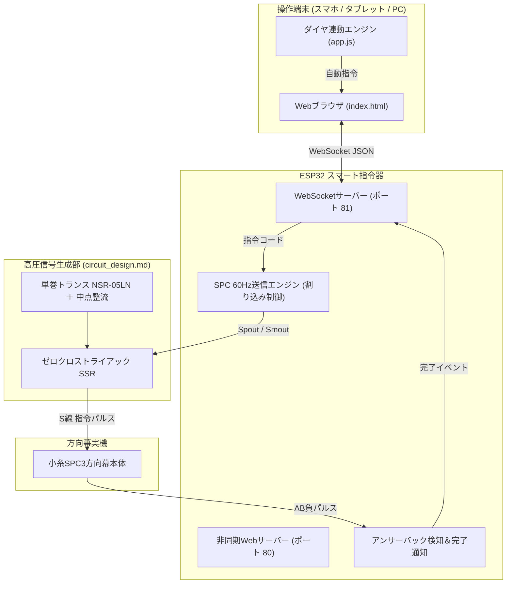

# スマートSPC方向幕指令器 設計計画書 (Smart Controller Plan)

## 1. 概要とコンセプト

本計画は、物理的なデジスイッチ操作に加え、**ESP32のWi-Fi通信機能を活用してスマートフォンやPCのWebブラウザから実物の方向幕を遠隔操作できる「スマートSPC指令器」**の設計仕様です。
Web UI資産は [`web/`](file:///Users/hiro/SPCDirectionCurtain/web/) ディレクトリに構築されています。

### 主な機能
1. **スマホWebリモコン**:
   * ブラウザ上の名鉄風UI（[`web/index.html`](file:///Users/hiro/SPCDirectionCurtain/web/index.html)）から、コマ番号・行先をタップするだけで、実車の方向幕が「カタカタカタ…」と連動して回転。
2. **リアルタイム運行ダイヤ自動連動モード**:
   * 現在時刻に合わせて、名鉄名古屋駅の時刻表（[`web/timetable.json`](file:///Users/hiro/SPCDirectionCurtain/web/timetable.json)）から「次の発車列車」を自動検索。
   * 自室の方向幕が、実車のダイヤに合わせて自動的に目的の行先にカチカチと切り替わるインテリア機能。
3. **スタンドアロン＆シミュレーション対応**:
   * ESP32実機がない状態でも、ブラウザ単体でリアルな方向幕プレビューや回転アニメーション、ダイヤ連動の動作確認が可能。

---

## 2. システム構成ブロック図



---

## 3. WebSocket 通信プロトコル仕様

ESP32とWebブラウザ間は、低遅延な **WebSocket（ポート 81）** で双方向JSON通信を行います。

### 3.1 クライアント ➔ ESP32（指令送信）
ブラウザ側でコマ番号が変更された時、または「指令送出」ボタンが押された時に送信されます。

```json
{
  "action": "send",
  "addr": 2,
  "code": 5
}
```
* `action`: `"send"`（指令送信）または `"stop"`（強制停止）
* `addr`: アドレス（0: 一斉、1: 前面幕、2: 側面幕）
* `code`: コマ番号（0〜255、例: 5 = 急行 中部国際空港）

### 3.2 ESP32 ➔ クライアント（状態通知）
方向幕が目的コマに到達し、アンサーバックが途絶えて停止した際に送信されます。

```json
{
  "status": "stopped",
  "addr": 2,
  "code": 5,
  "ab": false
}
```

---

## 4. Web UI資産（`web/` ディレクトリ）の展開方法

ESP32への展開方法は以下の2通りから選択できます。

### 方法A: ESP32の内蔵フラッシュ（LittleFS）に格納（完全スタンドアロン）
* `web/index.html`、`web/style.css`、`web/app.js`、`web/timetable.json` を ESP32 の LittleFS にアップロード。
* ESP32自身がWi-Fiアクセスポイント（SSID: `MEITETSU_ROLLSIGN`、PASS: `6500spc3`）として動作。
* スマホでESP32のWi-Fiに接続し、ブラウザで `http://192.168.4.1/` にアクセスするだけで、ルーターなしでどこでも操作可能。

### 方法B: ローカルブラウザで直接起動（PC / スマホ）
* PCやスマホのブラウザで直接 [`web/index.html`](file:///Users/hiro/SPCDirectionCurtain/web/index.html) を開く。
* 自宅のWi-Fiルーターに接続しているESP32のIPアドレス（例: `192.168.1.50`）を画面下の入力欄に入れ「接続」ボタンを押す。

---
*本計画書は、実物方向幕の魅力を現代のIoT技術と融合させ、日常のインテリア・趣味性を極限まで高めるための拡張仕様です。*
